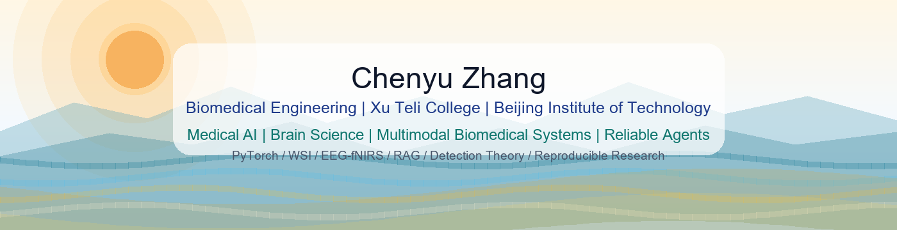

Chenyu Zhang's README.md / 中文版本在下方

<h1 align="center">Hi, I'm Chenyu Zhang 👋</h1>

<h3 align="center">Medical AI | Brain Science | Multimodal Biomedical Systems | Reliable Agents</h3>

  
  
  

  

---

## About Me

I am **Chenyu Zhang**, an undergraduate student in **Biomedical Engineering** at **Xu Teli College, Beijing Institute of Technology**.

My interests lie in **AI4Science and medical AI grounded in mathematical and physical principles**, especially **AI + brain science**, **AI + medicine**, multimodal biomedical representation learning, reliable AI systems, brain/biomedical signal modeling, and healthcare agents.

I hope to connect large-model representation and decision-making with detection-theoretic analysis and brain-inspired memory/plasticity mechanisms, toward AI systems that are more interpretable, reproducible, and useful in real biomedical settings.

---

## Current Focus

| Area | Questions I Care About |
| --- | --- |
| Medical Imaging AI | Fetal cardiac ultrasound, pathology WSI workflows, 3T-to-7T brain image generation, clinically meaningful evaluation |
| Brain and Biomedical Signals | EEG-fNIRS, multimodal fusion, temporal modeling, small samples, noisy labels |
| Reliable AI Systems | VLA runtime detection, sparse representation analysis, detection theory, auditable model outputs |
| Healthcare Agents | Medical RAG, tool calling, multi-agent diagnosis, safety checks, reproducible reports |
| AI Engineering | PyTorch, FastAPI, SQLite, local GUI workflows, MCP, reproducible experiment pipelines |

---

## Selected Projects

### MiniCode-Python - Terminal AI Coding Assistant

A Python-based terminal AI assistant with 30+ tools, context memory, planning-execution-iteration loops, and MCP integration.

`Python` `MCP` `Git` `Shell` `Agent Memory` `Tool Calling`

### NECIO System - Local Pathology WSI GUI and CellSAM Workflow

A local pathology slide analysis workflow built with CellSAM, OpenSlide, and SQLite, supporting SVS / NDPI / TIFF files, slide labeling, nuclei detection, feature extraction, local data management, and HTML report generation.

`Python` `TypeScript` `CellSAM` `OpenSlide` `WSI` `SQLite`

### Healthy Agent for World - Medical Multi-Agent Diagnosis System

A medical multi-agent prototype connecting triage, diagnosis, safety checks, evidence retrieval, confidence ranking, tool calling, audit logs, and reproducible reports.

`FastAPI` `RAG` `LLM Agent` `Audit Log` `Medical AI`

### Brain-Body Multimodal Disease Diagnosis

A reproducible biomedical data pipeline for cleaning, temporal windowing, sample alignment, early / late / attention-based fusion, and imbalanced-data handling.

`PyTorch` `Multimodal Fusion` `Temporal Modeling` `Biomedical Signals`

---

## Tech Stack

  
  
  
  
  
  
  
  

**Medical and Biomedical AI:** medical image analysis, WSI/pathology workflows, OpenSlide, CellSAM, semi-supervised learning, generative modeling, model evaluation  
**Brain-Inspired and Multimodal AI:** EEG-fNIRS analysis, multimodal fusion, temporal modeling, VLA runtime detection, sparse representation analysis  
**LLM and Agent Systems:** RAG, tool calling, biomedical knowledge retrieval, agent workflows, memory systems  
**Research Workflow:** literature review, baseline reproduction, experiment design, benchmarking, ablation analysis, manuscript writing

---

## 中文版本

### 关于我

你好，我是**张晨钰**，北京理工大学**徐特立学院**生物医学工程本科生。

我的研究兴趣聚焦于**基于数学与物理原理的 AI4Science 与医学 AI**，重点关注 **AI + 脑科学**、**AI + 医疗**、多模态医学表征学习、可靠 AI 系统、脑/生物医学信号建模和 healthcare agents。

我希望把大模型的表示与决策能力、检测理论分析，以及脑启发记忆/可塑性机制结合起来，构建更高效、更可解释、更能持续适应真实医学场景的智能系统。

### 我正在关注

| 方向 | 我关心的问题 |
| --- | --- |
| 医学影像 AI | 少标注胎儿心脏超声、病理 WSI、3T-to-7T 脑影像生成与临床相关评估 |
| 脑与生物医学信号 | EEG-fNIRS、多模态融合、时序建模、小样本与噪声标签 |
| 可靠 AI 系统 | VLA runtime detection、稀疏表征分析、检测理论、可审计模型输出 |
| Healthcare Agents | 医疗 RAG、tool calling、多智能体诊断、安全检查与可复现报告 |
| AI 工程 | PyTorch、FastAPI、SQLite、本地 GUI、MCP、可复现实验管线 |

### 精选项目

**MiniCode-Python - 终端 AI 编程助手**  
基于 Python 的终端 AI assistant，内置 30+ 工具、上下文记忆、规划-执行-迭代循环和 MCP 集成。

**NECIO System - 本地病理 WSI GUI 与 CellSAM 工作流**  
基于 CellSAM、OpenSlide 和 SQLite 构建本地病理切片分析工作流，支持 SVS / NDPI / TIFF，并覆盖切片标注、细胞核检测、特征提取、数据管理和 HTML 报告生成。

**Healthy Agent for World - 医疗多智能体诊断系统**  
连接分诊、诊断、安全检查、证据检索、置信度排序、tool calling、审计日志和可复现报告的医疗多智能体原型。

**脑-体多模态疾病诊断**  
构建多模态生物医学数据处理与实验管线，覆盖清洗、时间窗切片、样本对齐、early / late / attention fusion 和不平衡样本处理。

---

  <b>Building interpretable, reproducible, and workflow-ready AI systems for medicine and brain science.</b>

